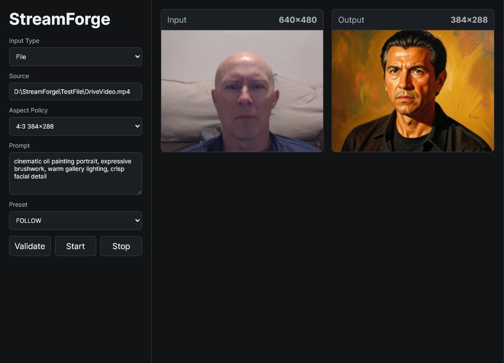
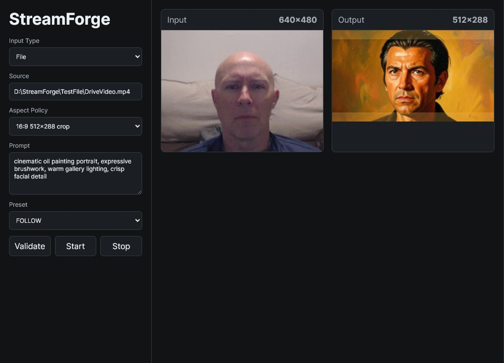
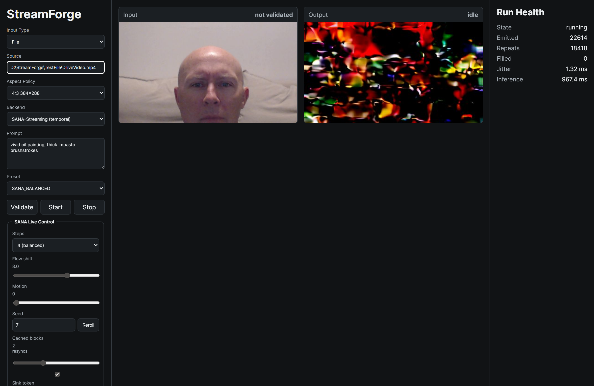

# StreamForge — Real-Time FLUX Live-Restyle Engine



Self-hosted, commercially-clean real-time live-restyle engine: live video in → FLUX.2-klein-4B (Apache-2.0) img2img restyle → media server (Resolume) via Spout/NDI, on a single RTX A6000. A **sacred output clock** runs at show framerate while the AI cadence adapts underneath it.

Two runtime backends share the same operator console, output clock, and sink pipeline: **FLUX** (one-frame-in/one-frame-out img2img) and **SANA-Streaming** (a chunk-causal temporal video-to-video model with native temporal memory — see [SANA_STREAMING.md](SANA_STREAMING.md)).

## Quick Start on Windows

From a Command Prompt or PowerShell window in the repo root:

```bat
install.bat
startup.bat
```

Then open `http://127.0.0.1:8765`.

`install.bat` creates `.venv`, installs CUDA PyTorch for CUDA 12.8, installs StreamForge dependencies, and installs the package in editable mode. Use `install.bat --models` when you also want to download the pinned model weights into `models/`.

`startup.bat` starts the local Operator Console. The console validates webcam, NDI, Spout, file, and synthetic inputs before starting the live pipeline, and shows real-time input/output previews.

## Development

```powershell
py -3.11 -m venv .venv
.\.venv\Scripts\Activate.ps1
pip install torch torchvision --index-url https://download.pytorch.org/whl/cu128
pip install -e .
pip install -r requirements.txt
pytest -m "not gpu and not model"   # pure-logic suite, no GPU/weights needed
```

## Operator Console

Run the local web console directly:

```powershell
$env:PYTHONPATH = "src"
.\.venv\Scripts\python.exe scripts\web.py
```

Open `http://127.0.0.1:8765`. The console validates webcam, NDI, Spout, file, and synthetic inputs before starting the live pipeline, then shows live input/output previews while the runner is active.

StreamForge uses fit-fill-and-crop aspect handling instead of stretching frames. Use `Auto preserve` for source-ratio-safe internal dimensions, or choose an explicit canvas such as `16:9` or `1:1` when cropped output is intentional.



Model weights live in `models/` (git-ignored). Run `.\.venv\Scripts\python.exe scripts\download_models.py` or `install.bat --models` to fetch the pinned manifest and freeze exact revisions into `manifest.yaml`.

NDI and Spout depend on local runtime support. NDI send/receive uses the Python NDI bindings; Spout is same-machine GPU texture sharing and requires a compatible Windows/graphics environment.

## SANA-Streaming backend (temporal)

StreamForge also runs **SANA-Streaming** (Apache-2.0), a chunk-causal video-to-video model with native temporal memory, as a second runtime backend. It installs into a separate `.venv-sana` (its dependency pins differ from the FLUX stack):

```bat
install.bat --sana
startup.bat --sana
```

`install.bat --sana` clones `NVlabs/Sana` into `external/Sana` at the pinned revision, builds `.venv-sana` (torch 2.11 + cu128 + `triton-windows`, SANA inference deps, `flash-linear-attention`, pure-python `mmcv`), and installs StreamForge into it. ~10 GB of weights (DiT + Gemma-2-2B + LTX-2 VAE) download to the Hugging Face cache on first run. `startup.bat --sana` launches the console under `.venv-sana`.

In the console, set **Backend → SANA-Streaming (temporal)**, pick `SANA_FAST` or `SANA_BALANCED`, choose a ≤512² aspect, then Validate/Start. The **SANA Live Control** panel tunes steps / flow shift / motion / seed live; cached-blocks / sink-token / prompt "resync" the recurrent state.



Verified on the RTX A6000 (BF16 + fused GDN Triton kernels, native Windows): ~22 fps @384×640 and ~21 fps @512² at step-4, ~27 fps at step-2 — real-time-capable at ≤512². Full build notes, performance, architecture, and caveats are in [SANA_STREAMING.md](SANA_STREAMING.md).
